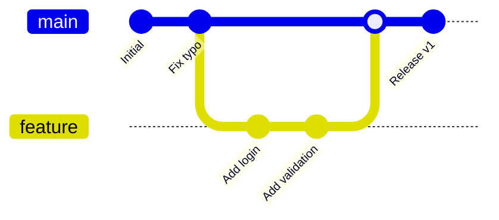

# Git vs Github

<div grid="~ cols-2 gap-4">
<div>
<span class="underline decoration-orange-500 underline-offset-2">Git :</span>

- est un outil local
- gère des commits, branches, tags
    
</div>
<div>
<span class="underline decoration-orange-500 underline-offset-2">GitHub / GitLab : </span>

- hébergent des dépôts
- ajoutent PR, permissions, UI

</div>
</div>
<br/>

<div class="pb-2 underline decoration-blue-500 underline-offset-2">Mini Quizz : Expliquer ce que font ces commandes ?</div>


```bash
mkdir test-project && cd test-project && git init
```
```bash
git remote add origin git@github.com:mindlaspe/test-project.git
```
```bash
git rebase mlapse-480/enhancements
```
```bash
git cherry-pick 0a25d48
```
<div class="mt-4 underline decoration-red-500 underline-offset-2 text-red-500 font-bold italic">Niveau Boss de fin (à expliquer pour briller en société)</div>
```bash
git rebase -i HEAD~10 --autosquash
```
```bash
git push --force-with-lease origin feature/login-v2
```

---

# Ce qu’est vraiment Git
Une successions de snapshots

- un journal
- une suite de snapshots
- une histoire du code

<arrow x1="600" y1="120" x2="500" y2="225" color="#953" width="2" arrowSize="1" />
<div
  class="absolute text-xs font-semibold text-[#953]"
  style="left: 610px; top: 100px;"
>
  C'est également le Hash (ou Sha1) du commit, par exemple 22a81b0014852685a97e4d7f7385a7fb6d0333c3 
</div>

<!-- Tailwind / Slidev (UnoCSS) -->
<div class="mx-auto w-200 px-6 py-2">
  <!-- 5 colonnes -->
  <div class="grid grid-cols-5 gap-x-5 gap-y-2 items-start text-center">
    <!-- ====== En-têtes ====== -->
    <div class="flex justify-center">
      <span class="inline-flex rounded-xl bg-violet-600 px-6 py-2 text-white font-semibold shadow">
        Initial version
      </span>
    </div>
    <div class="flex justify-center">
      <span class="inline-flex rounded-xl bg-violet-600 px-8 py-2 text-white font-semibold shadow">
        Version 2
      </span>
    </div>
    <div class="flex justify-center">
      <span class="inline-flex rounded-xl bg-violet-600 px-8 py-2 text-white font-semibold shadow">
        Version 3
      </span>
    </div>
    <div class="flex justify-center">
      <span class="inline-flex rounded-xl bg-violet-600 px-8 py-2 text-white font-semibold shadow">
        Version 4
      </span>
    </div>
    <div class="flex justify-center">
      <span class="inline-flex rounded-xl bg-violet-600 px-8 py-2 text-white font-semibold shadow">
        Version 5
      </span>
    </div>
    <!-- ====== Rangée 2 (A) ====== -->    
    <div class="flex justify-center pt-2">
      <div class="relative h-16 w-20">
        <!-- feuille -->
        <div class="absolute inset-0 rounded-lg border-4 border-slate-800 bg-white" style="clip-path: polygon(0 0, 75% 0, 100% 25%, 100% 100%, 0 100%);"></div>
        <!-- coin plié -->
        <div class="absolute right-0 top-0 h-8 w-8 border-4 border-slate-800 bg-white"
             style="clip-path: polygon(0 0, 100% 0, 100% 100%);"></div>
        <div class="absolute inset-0 grid place-items-center text-3xl font-extrabold text-slate-800">A</div>
      </div>
    </div>
    <div class="flex justify-center pt-2">
      <div class="relative h-16 w-20">
        <div class="absolute inset-0 rounded-lg border-4 border-emerald-400 bg-white" style="clip-path: polygon(0 0, 75% 0, 100% 25%, 100% 100%, 0 100%);"></div>
        <div class="absolute right-0 top-0 h-8 w-8 border-4 border-emerald-400 bg-white"
             style="clip-path: polygon(0 0, 100% 0, 100% 100%);"></div>
        <div class="absolute inset-0 grid place-items-center text-3xl font-extrabold text-slate-800">A1</div>
      </div>
    </div>
    <div class="flex justify-center pt-2">
      <div class="relative h-16 w-20">
        <div class="absolute inset-0 rounded-lg border-4 border-fuchsia-500 bg-white" style="clip-path: polygon(0 0, 75% 0, 100% 25%, 100% 100%, 0 100%);"></div>
        <div class="absolute right-0 top-0 h-8 w-8 border-4 border-fuchsia-500 bg-white"
             style="clip-path: polygon(0 0, 100% 0, 100% 100%);"></div>
        <div class="absolute inset-0 grid place-items-center text-3xl font-extrabold text-slate-800">A2</div>
      </div>
    </div>
    <div class="flex justify-center pt-2">
      <div class="relative h-16 w-20">
        <div class="absolute inset-0 rounded-lg border-4 border-orange-400 bg-white" style="clip-path: polygon(0 0, 75% 0, 100% 25%, 100% 100%, 0 100%);"></div>
        <div class="absolute right-0 top-0 h-8 w-8 border-4 border-orange-400 bg-white"
             style="clip-path: polygon(0 0, 100% 0, 100% 100%);"></div>
        <div class="absolute inset-0 grid place-items-center text-3xl font-extrabold text-slate-800">A3</div>
      </div>
    </div>
    <div class="flex justify-center pt-2">
      <div class="relative h-16 w-20">
        <div class="absolute inset-0 rounded-lg border-4 border-sky-400 bg-white" style="clip-path: polygon(0 0, 75% 0, 100% 25%, 100% 100%, 0 100%);"></div>
        <div class="absolute right-0 top-0 h-8 w-8 border-4 border-sky-400 bg-white"
             style="clip-path: polygon(0 0, 100% 0, 100% 100%);"></div>
        <div class="absolute inset-0 grid place-items-center text-3xl font-extrabold text-slate-800">A4</div>
      </div>
    </div>
    <!-- ====== Rangée 2 (B) ====== -->
    <div class="flex justify-center pt-2">
      <div class="relative h-16 w-20">
        <div class="absolute inset-0 rounded-lg border-4 border-slate-800 bg-white" style="clip-path: polygon(0 0, 75% 0, 100% 25%, 100% 100%, 0 100%);"></div>
        <div class="absolute right-0 top-0 h-8 w-8 border-4 border-slate-800 bg-white"
             style="clip-path: polygon(0 0, 100% 0, 100% 100%);"></div>
        <div class="absolute inset-0 grid place-items-center text-3xl font-extrabold text-slate-800">B</div>
      </div>
    </div>
    <div class="flex justify-center pt-2">
      <div class="relative h-16 w-20">
        <div class="absolute inset-0 rounded-lg border-4 border-slate-800 bg-white" style="clip-path: polygon(0 0, 75% 0, 100% 25%, 100% 100%, 0 100%);"></div>
        <div class="absolute right-0 top-0 h-8 w-8 border-4 border-slate-800 bg-white"
             style="clip-path: polygon(0 0, 100% 0, 100% 100%);"></div>
        <div class="absolute inset-0 grid place-items-center text-3xl font-extrabold text-slate-800">B</div>
      </div>
    </div>
    <div class="flex justify-center pt-2">
      <div class="relative h-16 w-20">
        <div class="absolute inset-0 rounded-lg border-4 border-emerald-400 bg-white" style="clip-path: polygon(0 0, 75% 0, 100% 25%, 100% 100%, 0 100%);"></div>
        <div class="absolute right-0 top-0 h-8 w-8 border-4 border-emerald-400 bg-white"
             style="clip-path: polygon(0 0, 100% 0, 100% 100%);"></div>
        <div class="absolute inset-0 grid place-items-center text-3xl font-extrabold text-slate-800">B1</div>
      </div>
    </div>
    <div class="flex justify-center pt-2">
      <div class="relative h-16 w-20">
        <div class="absolute inset-0 rounded-lg border-4 border-fuchsia-500 bg-white" style="clip-path: polygon(0 0, 75% 0, 100% 25%, 100% 100%, 0 100%);"></div>
        <div class="absolute right-0 top-0 h-8 w-8 border-4 border-fuchsia-500 bg-white"
             style="clip-path: polygon(0 0, 100% 0, 100% 100%);"></div>
        <div class="absolute inset-0 grid place-items-center text-3xl font-extrabold text-slate-800">B2</div>
      </div>
    </div>
    <div class="flex justify-center pt-2">
      <div class="relative h-16 w-20">
        <div class="absolute inset-0 rounded-lg border-4 border-fuchsia-500 bg-white" style="clip-path: polygon(0 0, 75% 0, 100% 25%, 100% 100%, 0 100%);"></div>
        <div class="absolute right-0 top-0 h-8 w-8 border-4 border-fuchsia-500 bg-white"
             style="clip-path: polygon(0 0, 100% 0, 100% 100%);"></div>
        <div class="absolute inset-0 grid place-items-center text-3xl font-extrabold text-slate-800">B2</div>
      </div>
    </div>
    <!-- ====== Rangée 3 (C) ====== -->
    <div class="flex justify-center pt-2">
      <div class="relative h-16 w-20">
        <div class="absolute inset-0 rounded-lg border-4 border-slate-800 bg-white" style="clip-path: polygon(0 0, 75% 0, 100% 25%, 100% 100%, 0 100%);"></div>
        <div class="absolute right-0 top-0 h-8 w-8 border-4 border-slate-800 bg-white"
             style="clip-path: polygon(0 0, 100% 0, 100% 100%);"></div>
        <div class="absolute inset-0 grid place-items-center text-3xl font-extrabold text-slate-800">C</div>
      </div>
    </div>
    <div class="flex justify-center pt-2">
      <div class="relative h-16 w-20">
        <div class="absolute inset-0 rounded-lg border-4 border-slate-800 bg-white" style="clip-path: polygon(0 0, 75% 0, 100% 25%, 100% 100%, 0 100%);"></div>
        <div class="absolute right-0 top-0 h-8 w-8 border-4 border-slate-800 bg-white"
             style="clip-path: polygon(0 0, 100% 0, 100% 100%);"></div>
        <div class="absolute inset-0 grid place-items-center text-3xl font-extrabold text-slate-800">C</div>
      </div>
    </div>
    <div class="flex justify-center pt-2">
      <div class="relative h-16 w-20">
        <div class="absolute inset-0 rounded-lg border-4 border-emerald-400 bg-white" style="clip-path: polygon(0 0, 75% 0, 100% 25%, 100% 100%, 0 100%);"></div>
        <div class="absolute right-0 top-0 h-8 w-8 border-4 border-emerald-400 bg-white"
             style="clip-path: polygon(0 0, 100% 0, 100% 100%);"></div>
        <div class="absolute inset-0 grid place-items-center text-3xl font-extrabold text-slate-800">C1</div>
      </div>
    </div>
    <div class="flex justify-center pt-2">
      <div class="relative h-16 w-20">
        <div class="absolute inset-0 rounded-lg border-4 border-emerald-400 bg-white" style="clip-path: polygon(0 0, 75% 0, 100% 25%, 100% 100%, 0 100%);"></div>
        <div class="absolute right-0 top-0 h-8 w-8 border-4 border-emerald-400 bg-white"
             style="clip-path: polygon(0 0, 100% 0, 100% 100%);"></div>
        <div class="absolute inset-0 grid place-items-center text-3xl font-extrabold text-slate-800">C1</div>
      </div>
    </div>
    <div class="flex justify-center pt-2">
      <div class="relative h-16 w-20">
        <div class="absolute inset-0 rounded-lg border-4 border-emerald-400 bg-white" style="clip-path: polygon(0 0, 75% 0, 100% 25%, 100% 100%, 0 100%);"></div>
        <div class="absolute right-0 top-0 h-8 w-8 border-4 border-emerald-400 bg-white"
             style="clip-path: polygon(0 0, 100% 0, 100% 100%);"></div>
        <div class="absolute inset-0 grid place-items-center text-3xl font-extrabold text-slate-800">C1</div>
      </div>
    </div>
  </div>
</div>

--- 


# Git est aussi vu comme un graphe
Un DAG (Directed Acyclic Graph) : Pas de cycle, un seul parent

<GitGraphAnimation />

---

<div>


# Commit, Branch, HEAD

Avant de manipuler, il faut comprendre la structure

* **Le Commit** : Ce n'est pas un "diff", c'est un **snapshot** (instantané) complet, **lié à <u>son</u> parent**
* **La Branche** : Ce n'est qu'un **pointeur** (un fichier texte avec un ID).
* **Le HEAD** : L'indicateur "Vous êtes ici".
<br/><br/>

<GitBranchAnimation />
</div>

---
hide: true
---

# Mais c'est aussi un Graphe unidirectionnel
Chaque commit connaît son parent, mais ne connaît pas ses enfants.

<div class="grid grid-cols-2 gap-10 mb-4">

<div>

### Pourquoi un graphe ?
* **Historique non-linéaire** : Permet de faire des branches et des merges sans perdre le fil.
* **Traçabilité** : On peut remonter jusqu'au premier commit (`root`) en suivant les flèches.
* **Immuabilité** : Un commit est **immutable** si vous faites un `git commit --amend` vous ne le modifiez pas vous créez un **autre commit** avec un nouveau **Hash(SHA-1)**.

</div>

<div class="bg-gray-800 p-4 rounded">


</div>
</div>

> **Note :** Chaque commit pointe vers son **ancêtre unique** (sauf pour les merges qui ont deux parents).
