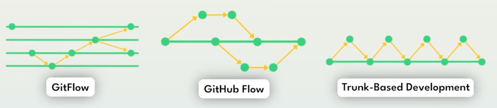

# Git Workflows
Comprendre l'évolution des workflows git

<Callout type="info" title="Important">
  Le choix tel ou tel type de Workflow Git pour une équipe est très structurant.<br/>
  Choisir celui qui convient le mieux à votre équipe est primordial et dépends de ce qu'on construit et comment on le déploie.

  - Ce n'est pas le même flow pour une application mobile qui doit supporter plusieurs versions téléchargeables par les end users en même temps
  - Que pour une application en déploiement continu plusieurs fois par jour ou par semaine vers une seule version cible
</Callout>



---

# Git Flow
**"Le"** Standard pendant très longtemps récemment considéré "Bad Practice"

<!--
- Plusieurs branches de durée de vie longues chacune ayant un rôle particulier
  - Branche Main : Code **Production Ready**
  - Branche Develop : Code **Work in Progress**
  - Branches Features : Code pour les **Nouvelles features**
  - Branches Release : Pour préparer le déploiement (Vérifier, Tester, etc)
  - Branches Hotfix : Pour Fix en urgence en production
-->
  <GitFlowMap />


--- 

# Trunk-Based Development (TBD)
L'alternative performante au GitFlow.

Le but : Éviter la divergence de code (le "Merge Hell").

### Les piliers :

* **Branches features à durée de vie courte** : Idéalement <span class="underline decoration-orange-500 underline-offset-2">moins de 24h</span> (_commençons par 1 à 3 jours_)
* **MAIN est sacrée** : La branche principale doit toujours être stable et déployable.
* **Intégration constante** : On n'attend pas la fin de la feature pour confronter son code à celui des (_modulo feature flags ou Dépendances US de type migrations_)

| Pratique | Bénéfice |
| :--- | :--- |
| **Petits branches** | Revues de code plus simples et rapides |
| **Merges fréquents** | Conflits mineurs et faciles à résoudre |
| **Feature Flags** | Permet de merger du code "incomplet" sans l'activer (_Complex, use way Later !_) |

---
layout: default
---

# Trunk-based : branches courtes + merges fréquents

<div class="relative mt-[-40px] h-60">

  <!-- Trunk line (always visible) -->
  <div
    class="absolute left-10 right-10 top-32 h-1 rounded bg-gray-300"
    v-motion
    :initial="{ opacity: 0, scaleX: 0 }"
    :enter="{ opacity: 1, scaleX: 1, transition: { duration: 500  } }"
  ></div>

  <!-- DEV label (always visible) -->
  <div
    class="absolute left-10 top-36 text-sm text-gray-600"
    v-motion
    :initial="{ opacity: 0, y: 10 }"
    :enter="{ opacity: 1, y: 0, transition: { delay: 500  } }"
  >
    DEV (trunk)
  </div>

<div class="absolute top-30 left-[23%] w-4 h-4 rounded-full bg-orange-500"></div>
<div class="absolute top-30 left-[13%] w-4 h-4 rounded-full bg-orange-600"></div>
<div class="absolute top-30 left-[33%] w-4 h-4 rounded-full bg-orange-300"></div>
    
 <!-- Base commits on trunk (always visible) -->
<!--<div class="absolute top-30 left-[58%] w-4 h-4 rounded-full bg-gray-700"></div>-->
  <!-- ===================== -->
  <!-- Click 1: Tia branch    -->
  <!-- ===================== -->

  <div v-click="1">
    <!-- branch line vertical -->
    <div
        class="absolute top-34 left-[292px] w-1 rounded bg-blue-400 origin-top"
        style="height: 90px"
        v-motion
        :initial="{ scaleY: 0, opacity: 0 }"
        :enter="{ scaleY: 1, opacity: 1, transition: { duration: 550 } }"
        />
    <!-- label -->
    <div
      class="absolute left-[35%] top-[200px] -translate-x-1/2 text-blue-400 text-sm"
      v-motion
      :initial="{ opacity: 0, scale: 0.95 }"
      :enter="{ opacity: 1, scale: 1, transition: { duration: 550 } }"
    >
            branche Tia (1j)
    </div>   
  </div>

  <div v-click="1">
    <!-- branch line horizontal-->   
    <div
        class="absolute top-56 left-[292px] h-1 rounded bg-blue-400 origin-left"
        style="width: 132px"
        v-motion
        :initial="{ scaleX: 0, opacity: 0 }"
        :enter="{ scaleX: 1, opacity: 1, transition: { duration: 550 } }"
        />
  </div>

  <div v-click="1">
    <!-- branch line vertical -->
   <div class="absolute top-[135px] left-[416px] flex flex-col items-center">
    <!-- Arrow head -->
    <div
        class="w-0 h-0
            border-l-[6px] border-r-[6px] border-b-[10px]
            border-l-transparent border-r-transparent border-b-blue-400"
        v-motion
        :initial="{ scale: 0, opacity: 0 }"
        :enter="{ scale: 1, opacity: 1, transition: { delay: 300 } }"
    ></div>
    <!-- Arrow body -->
    <div
        class="w-1 h-[82px] rounded bg-blue-400 origin-top"
        v-motion
        :initial="{ scaleY: 0, opacity: 0 }"
        :enter="{ scaleY: 1, opacity: 1, transition: { duration: 400 } }"
    ></div>
    </div>
    <!-- Merge commit -->
    <div
      class="absolute top-30 left-[414px] w-4 h-4 rounded-full bg-blue-700"
      v-motion
      :initial="{ opacity: 0, scale: 0.8 }"
      :enter="{ opacity: 1, scale: 1, transition: { duration: 200 } }"
    ></div>    
    <div class="absolute top-[218px] left-[310px] w-4 h-4 rounded-full bg-blue-400"></div>
    <div class="absolute top-[218px] left-[360px] w-4 h-4 rounded-full bg-blue-400"></div>
    <div class="absolute top-[218px] left-[390px] w-4 h-4 rounded-full bg-blue-400"></div>
    <div
      class="absolute left-[430px] top-[130px] -translate-x-1/2 text-blue-400 text-sm"
      v-motion
      :initial="{ opacity: 0, scale: 0.95 }"
      :enter="{ opacity: 1, scale: 1, transition: { duration: 250 } }"
    >
      merge vers DEV
    </div>
  </div>

  <div v-click="2">
    <!-- branch line vertical -->
    <div
      class="absolute top-[30px] left-[420px] w-1 rounded bg-purple-400 origin-top"
      v-motion
      :initial="{ height: 0, opacity: 0 }"
      :enter="{ height: 90, opacity: 1, transition: { duration: 400 } }"
    ></div>
    <!-- label -->
    <div
      class="absolute left-[430px] top-[40px] -translate-x-1/2 text-purple-400 text-sm"
      v-motion
      :initial="{ opacity: 0, scale: 0.95 }"
      :enter="{ opacity: 1, scale: 1, transition: { duration: 250 } }"
    >
            branche Simon (1j)
    </div>   
  </div>
 
  <div v-click="2">
    <!-- branch line horizontal-->   
    <div
      class="absolute top-[30px] left-[420px] w-1 rounded bg-purple-400 origin-top"
      v-motion
      :initial="{ height:5, width: 0, opacity: 0 }"
      :enter="{ width: 140, opacity: 1, transition: { duration: 400  } }"
    ></div>
  </div>

  <div v-click="2">
    <!-- branch line vertical -->
   <div class="absolute top-[30px] left-[552px] flex flex-col items-center">
    <!-- Arrow body -->
    <div
        class="w-1 h-[82px] rounded bg-purple-400 origin-top"
        v-motion
        :initial="{ scaleY: 0, opacity: 0 }"
        :enter="{ scaleY: 1, opacity: 1, transition: { duration: 400  } }"
    ></div>
    <!-- Arrow head -->
    <div
        class="w-0 h-0
            border-l-[6px] border-r-[6px] border-t-[10px]
            border-l-transparent border-r-transparent border-t-purple-400"
        v-motion
        :initial="{ scale: 0, opacity: 0 }"
        :enter="{ scale: 1, opacity: 1, transition: { delay: 300 } }"
    ></div>
    </div>
    <!-- Merge commit -->
    <div
      class="absolute top-30 left-[550px] w-4 h-4 rounded-full bg-purple-700"
      v-motion
      :initial="{ opacity: 0, scale: 0.8 }"
      :enter="{ opacity: 1, scale: 1, transition: { duration: 200 } }"
    ></div>    
    <div class="absolute top-[24px] left-[510px] w-4 h-4 rounded-full bg-purple-400"></div>
    <div class="absolute top-[24px] left-[460px] w-4 h-4 rounded-full bg-purple-400"></div> 
    <div
      class="absolute left-[430px] top-[130px] -translate-x-1/2 text-blue-400 text-sm"
      v-motion
      :initial="{ opacity: 0, scale: 0.95 }"
      :enter="{ opacity: 1, scale: 1, transition: { duration: 250 } }"
    >
      merge vers DEV
    </div>
  </div>

</div>


````md magic-move {lines: true}
```bash {*}
commit cee8d659b3232a70efc0e6d8b77525862e215e09 (Wed Feb 11 14:57:23 2026 +0100)
    Merge pull request #297 from Mindlapse-ai/mlapse-0-auto-update-dependabot
    chore(deps): Auto-update Dependabot configuration
commit 71e734a985e35593301b4ec500348aecc644f9e9 (Wed Feb 11 12:17:43 2026 +0100)
    Merge pull request #298 from Mindlapse-ai/mlapse-0-auto-update-requirements
    chore(deps): Auto-update requirements.txt for vulnerability scanning
commit 1b9a6546a96eb4eaac4483118b29d8bf979f94b1 (Wed Feb 11 10:27:11 2026 +0100)
    fix(ai): correct logic errors in dataclasses model
```

```bash {*}
commit 30f6b8749c671c66804b9044eafee64fa3542dda (Thu Feb 12 10:11:44 2026 +0100)
    Merge branch 'dev' into mlapse-664-adapt-custom-questionnaire-based-on-control-atlas-v2
commit cee8d659b3232a70efc0e6d8b77525862e215e09 (Wed Feb 11 14:57:23 2026 +0100)
    Merge pull request #297 from Mindlapse-ai/mlapse-0-auto-update-dependabot
    chore(deps): Auto-update Dependabot configuration
commit 71e734a985e35593301b4ec500348aecc644f9e9 (Wed Feb 11 12:17:43 2026 +0100)
    Merge pull request #298 from Mindlapse-ai/mlapse-0-auto-update-requirements
    chore(deps): Auto-update requirements.txt for vulnerability scanning
commit 1b9a6546a96eb4eaac4483118b29d8bf979f94b1 (Wed Feb 11 10:27:11 2026 +0100)
    fix(ai): correct logic errors in dataclasses model
```

```bash {*}
commit d34291c6d44d17c923fdaeb6099d902a898f4efb (Fri Feb 13 09:22:15 2026 +0100)
    Merge pull request #294 from Mindlapse-ai/mlapse-664-adapt-custom-questionnaire-based-on-control-atlas-v2
    Mlapse 664 adapt custom questionnaire based on control atlas v2
commit 30f6b8749c671c66804b9044eafee64fa3542dda (Thu Feb 12 10:11:44 2026 +0100)
    Merge branch 'dev' into mlapse-664-adapt-custom-questionnaire-based-on-control-atlas-v2
commit cee8d659b3232a70efc0e6d8b77525862e215e09 (Wed Feb 11 14:57:23 2026 +0100)
    Merge pull request #297 from Mindlapse-ai/mlapse-0-auto-update-dependabot
    chore(deps): Auto-update Dependabot configuration
commit 71e734a985e35593301b4ec500348aecc644f9e9 (Wed Feb 11 12:17:43 2026 +0100)
    Merge pull request #298 from Mindlapse-ai/mlapse-0-auto-update-requirements
    chore(deps): Auto-update requirements.txt for vulnerability scanning
commit 1b9a6546a96eb4eaac4483118b29d8bf979f94b1 (Wed Feb 11 10:27:11 2026 +0100)
    fix(ai): correct logic errors in dataclasses model
```
````

---
layout: default
---

# Trunk-based : conflits

<div class="relative mt-[-40px] h-60">

  <!-- Trunk line (always visible) -->
  <div
    class="absolute left-10 right-10 top-32 h-1 rounded bg-gray-300"
    v-motion
    :initial="{ opacity: 0, scaleX: 0 }"
    :enter="{ opacity: 1, scaleX: 1, transition: { duration: 500  } }"
  ></div>

  <!-- DEV label (always visible) -->
  <div
    class="absolute left-10 top-36 text-sm text-gray-600"
    v-motion
    :initial="{ opacity: 0, y: 10 }"
    :enter="{ opacity: 1, y: 0, transition: { delay: 500  } }"
  >
    DEV (trunk)
  </div>

<div class="absolute top-30 left-[23%] w-4 h-4 rounded-full bg-orange-500"></div>
<div class="absolute top-30 left-[13%] w-4 h-4 rounded-full bg-orange-600"></div>
<div class="absolute top-30 left-[33%] w-4 h-4 rounded-full bg-orange-300"></div>
    
 <!-- Base commits on trunk (always visible) -->
<!--<div class="absolute top-30 left-[58%] w-4 h-4 rounded-full bg-gray-700"></div>-->
  <!-- ===================== -->
  <!-- Click 1: Tia branch    -->
  <!-- ===================== -->

  <div v-click="1">
    <!-- branch line vertical -->
    <div
        class="absolute top-34 left-[292px] w-1 rounded bg-blue-400 origin-top"
        style="height: 90px"
        v-motion
        :initial="{ scaleY: 0, opacity: 0 }"
        :enter="{ scaleY: 1, opacity: 1, transition: { duration: 550 } }"
        />
    <!-- label -->
    <div
      class="absolute left-[35%] top-[200px] -translate-x-1/2 text-blue-400 text-sm"
      v-motion
      :initial="{ opacity: 0, scale: 0.95 }"
      :enter="{ opacity: 1, scale: 1, transition: { duration: 550 } }"
    >
            branche Tia (1j)
    </div>   
  </div>

  <div v-click="1">
    <!-- branch line horizontal-->   
    <div
        class="absolute top-56 left-[292px] h-1 rounded bg-blue-400 origin-left"
        style="width: 132px"
        v-motion
        :initial="{ scaleX: 0, opacity: 0 }"
        :enter="{ scaleX: 1, opacity: 1, transition: { duration: 550 } }"
        />
  </div>

  <div v-click="1">
    <!-- branch line vertical -->
   <div class="absolute top-[135px] left-[416px] flex flex-col items-center">
    <!-- Arrow head -->
    <div
        class="w-0 h-0
            border-l-[6px] border-r-[6px] border-b-[10px]
            border-l-transparent border-r-transparent border-b-blue-400"
        v-motion
        :initial="{ scale: 0, opacity: 0 }"
        :enter="{ scale: 1, opacity: 1, transition: { delay: 300 } }"
    ></div>
    <!-- Arrow body -->
    <div
        class="w-1 h-[82px] rounded bg-blue-400 origin-top"
        v-motion
        :initial="{ scaleY: 0, opacity: 0 }"
        :enter="{ scaleY: 1, opacity: 1, transition: { duration: 400 } }"
    ></div>
    </div>
    <!-- Merge commit -->
    <div
      class="absolute top-30 left-[414px] w-4 h-4 rounded-full bg-blue-700"
      v-motion
      :initial="{ opacity: 0, scale: 0.8 }"
      :enter="{ opacity: 1, scale: 1, transition: { duration: 200 } }"
    ></div>    
    <div class="absolute top-[218px] left-[310px] w-4 h-4 rounded-full bg-blue-400"></div>
    <div class="absolute top-[218px] left-[360px] w-4 h-4 rounded-full bg-blue-400"></div>
    <div class="absolute top-[218px] left-[390px] w-4 h-4 rounded-full bg-blue-400"></div>
    <div
      class="absolute left-[430px] top-[130px] -translate-x-1/2 text-blue-400 text-sm"
      v-motion
      :initial="{ opacity: 0, scale: 0.95 }"
      :enter="{ opacity: 1, scale: 1, transition: { duration: 250 } }"
    >
      merge vers DEV
    </div>
  </div>

  <div v-click="2">
    <!-- branch line vertical -->
    <div
      class="absolute top-[30px] left-[292px] w-1 rounded bg-purple-400 origin-top"
      v-motion
      :initial="{ height: 0, opacity: 0 }"
      :enter="{ height: 90, opacity: 1, transition: { duration: 400 } }"
    ></div>
    <!-- label -->
    <div
      class="absolute left-[302px] top-[40px] -translate-x-1/2 text-purple-400 text-sm"
      v-motion
      :initial="{ opacity: 0, scale: 0.95 }"
      :enter="{ opacity: 1, scale: 1, transition: { duration: 250 } }"
    >
            branche Simon (1j)
    </div>   
  </div>
 
  <div v-click="2">
    <!-- branch line horizontal-->   
    <div
      class="absolute top-[30px] left-[292px] w-1 rounded bg-purple-400 origin-top"
      v-motion
      :initial="{ height:5, width: 0, opacity: 0 }"
      :enter="{ width: 268, opacity: 1, transition: { duration: 400  } }"
    ></div>
  </div>

  <div v-click="2">
    <!-- branch line vertical -->
   <div class="absolute top-[30px] left-[552px] flex flex-col items-center">
    <!-- Arrow body -->
    <div
        class="w-1 h-[82px] rounded bg-purple-400 origin-top"
        v-motion
        :initial="{ scaleY: 0, opacity: 0 }"
        :enter="{ scaleY: 1, opacity: 1, transition: { duration: 400  } }"
    ></div>
    <!-- Arrow head -->
    <div
        class="w-0 h-0
            border-l-[6px] border-r-[6px] border-t-[10px]
            border-l-transparent border-r-transparent border-t-purple-400"
        v-motion
        :initial="{ scale: 0, opacity: 0 }"
        :enter="{ scale: 1, opacity: 1, transition: { delay: 300 } }"
    ></div>
    </div>
    <!-- Merge commit -->
    <div
      class="absolute top-30 left-[550px] w-4 h-4 rounded-full bg-purple-700"
      v-motion
      :initial="{ opacity: 0, scale: 0.8 }"
      :enter="{ opacity: 1, scale: 1, transition: { duration: 200 } }"
    ></div>    
    <div class="absolute top-[24px] left-[510px] w-4 h-4 rounded-full bg-purple-400"></div>
    <div class="absolute top-[24px] left-[330px] w-4 h-4 rounded-full bg-purple-400"></div>
    <div class="absolute top-[24px] left-[460px] w-4 h-4 rounded-full bg-purple-400"></div> 
    <div
      class="absolute left-[430px] top-[130px] -translate-x-1/2 text-blue-400 text-sm"
      v-motion
      :initial="{ opacity: 0, scale: 0.95 }"
      :enter="{ opacity: 1, scale: 1, transition: { duration: 250 } }"
    >
      merge vers DEV
    </div>
  </div>

</div>


````md magic-move {lines: true}
```bash {*}
commit cee8d659b3232a70efc0e6d8b77525862e215e09 (Wed Feb 11 14:57:23 2026 +0100)
    Merge pull request #297 from Mindlapse-ai/mlapse-0-auto-update-dependabot
    chore(deps): Auto-update Dependabot configuration
commit 71e734a985e35593301b4ec500348aecc644f9e9 (Wed Feb 11 12:17:43 2026 +0100)
    Merge pull request #298 from Mindlapse-ai/mlapse-0-auto-update-requirements
    chore(deps): Auto-update requirements.txt for vulnerability scanning
commit 1b9a6546a96eb4eaac4483118b29d8bf979f94b1 (Wed Feb 11 10:27:11 2026 +0100)
    fix(ai): correct logic errors in dataclasses model
```

```bash {*}
commit 30f6b8749c671c66804b9044eafee64fa3542dda (Thu Feb 12 10:11:44 2026 +0100)
    Merge branch 'dev' into mlapse-664-adapt-custom-questionnaire-based-on-control-atlas-v2
commit cee8d659b3232a70efc0e6d8b77525862e215e09 (Wed Feb 11 14:57:23 2026 +0100)
    Merge pull request #297 from Mindlapse-ai/mlapse-0-auto-update-dependabot
    chore(deps): Auto-update Dependabot configuration
commit 71e734a985e35593301b4ec500348aecc644f9e9 (Wed Feb 11 12:17:43 2026 +0100)
    Merge pull request #298 from Mindlapse-ai/mlapse-0-auto-update-requirements
    chore(deps): Auto-update requirements.txt for vulnerability scanning
commit 1b9a6546a96eb4eaac4483118b29d8bf979f94b1 (Wed Feb 11 10:27:11 2026 +0100)
    fix(ai): correct logic errors in dataclasses model
```

```bash {*}
commit d34291c6d44d17c923fdaeb6099d902a898f4efb (Fri Feb 13 09:22:15 2026 +0100)
    Merge pull request #294 from Mindlapse-ai/mlapse-664-adapt-custom-questionnaire-based-on-control-atlas-v2
    Mlapse 664 adapt custom questionnaire based on control atlas v2
commit 30f6b8749c671c66804b9044eafee64fa3542dda (Thu Feb 12 10:11:44 2026 +0100)
    Merge branch 'dev' into mlapse-664-adapt-custom-questionnaire-based-on-control-atlas-v2
commit cee8d659b3232a70efc0e6d8b77525862e215e09 (Wed Feb 11 14:57:23 2026 +0100)
    Merge pull request #297 from Mindlapse-ai/mlapse-0-auto-update-dependabot
    chore(deps): Auto-update Dependabot configuration
commit 71e734a985e35593301b4ec500348aecc644f9e9 (Wed Feb 11 12:17:43 2026 +0100)
    Merge pull request #298 from Mindlapse-ai/mlapse-0-auto-update-requirements
    chore(deps): Auto-update requirements.txt for vulnerability scanning
commit 1b9a6546a96eb4eaac4483118b29d8bf979f94b1 (Wed Feb 11 10:27:11 2026 +0100)
    fix(ai): correct logic errors in dataclasses model
```
````
