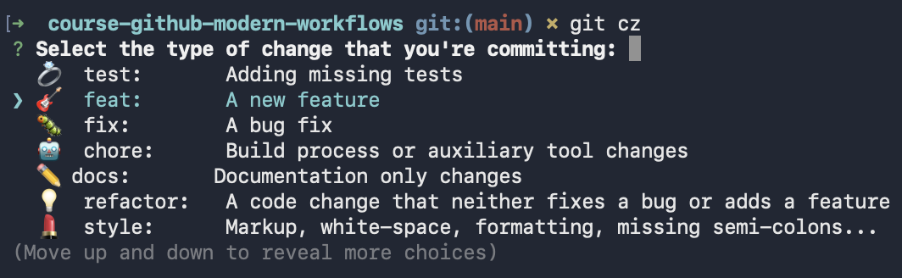

# L'art du commit efficace
Un bon historique est un outil de documentation.

### Atomicité : Un commit = Une intention.

- ❌ `Correction bug mineur + refacto classe User + changement couleur bouton`
- ✅ `fix: correct user login validation`
- ✅ `refactor: simplify auth service logic`
  

### Conventional Commits

- `feat:` (nouvelle fonctionnalité)
- `fix:` (correction)
- `chore:` (maintenance, dépendances)
- `docs:` (documentation)

    

---

# L'Immuabilité : On ne modifie pas, on bifurque
Dans Git, un commit est **immuable**, il ne peut plus être modifié 

Si vous tentez de "modifier" un commit passé (via un `amend` ou un `rebase`) :

1. **Création d'un nouveau commit** : Git génère un nouveau hash pour refléter vos modifications.
2. Votre pointeur **HEAD** ainsi que votre branche se déplacent sur ce nouveau commit
3. l'ancien commit est devenu invisible dans le `git log` car aucun pointeur ne le désigne, il est devenu **orphelin ou dangling commit**, mais il n'est pas encore mort.
4. il est toujours là, dans les entrailles de ton dossier .git et peut être récupéré avec `git reflog` 
5. Par défaut, Git garde les commits orphelins environ **30 à 90 jours**.
6. Ensuite, la commande `git gc` (lancée automatiquement de temps en temps) supprime définitivement les objets qui ne sont plus reliés à aucune branche.
  

> **Leçon pour l'équipe :** Vous avez le droit à l'erreur. Tant que vous n'avez pas attendu 3 mois ou supprimé votre dossier `.git`, tout est récupérable.

---