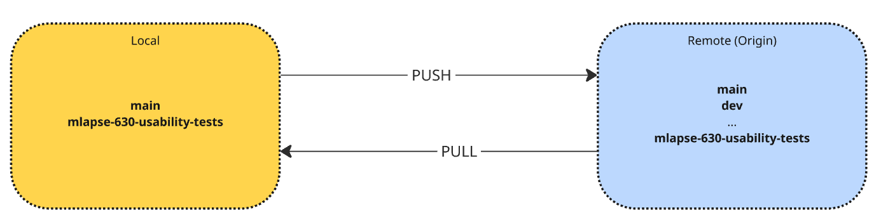
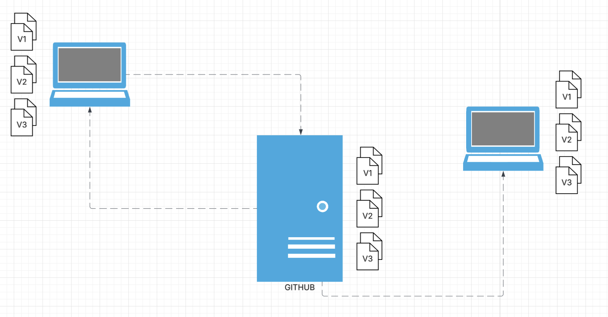
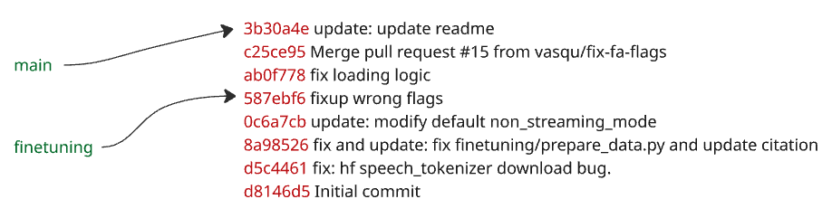

# Le dépôt distant (remote)
Connaitre le (les) remote (s)

```bash
git remote -v # Affiche les serveurs distants avec lesquels votre projet communique.
origin	git@github.com:Mindlapse-ai/mindlapse-app.git (fetch)
origin	git@github.com:Mindlapse-ai/mindlapse-app.git (push)
```



* **`origin`** : C'est juste un alias (un nom court). Par convention, c'est le serveur principal, mais on pourrait l'appeler `maman` ou `prod`.
* **fetch** : D'où vous tirez les nouveautés.
* **push** : Où vous envoyez votre code.
* On peut push sur 2 remotes (ou même pull), mais c'est généralement déconseillé


---

## 4. Gérer les conflits sans stress
Le conflit n'est pas une erreur, c'est une demande d'arbitrage.

### Stratégie : Le Rebase
Le rebase permet de maintenir un historique **linéaire**.

1. `git checkout ma-feature`
2. `git fetch origin`
3. `git rebase origin/main`
   *Git réapplique vos commits un par un par-dessus le travail actuel de l'équipe.*
4. En cas de conflit : On répare, `git add`, et `git rebase --continue`.

> **Attention :** On ne rebase jamais une branche publique (déjà partagée avec d'autres). On rebase son travail local avant de le pousser.

---

## 5. Collaboration & Pull Requests (PR)
La PR est une conversation, pas une validation administrative.

* **La règle des 200 lignes** : Une PR courte est relue en 5 minutes. Une PR de 1000 lignes est "approuvée" sans être lue.
* **Expliquer le "Pourquoi"** : Le code dit *comment* vous avez fait, la description de la PR doit dire *pourquoi* vous avez fait ce choix.
* **Automatisation (CI)** : La CI (tests, lint) doit passer **avant** qu'un humain n'ouvre la PR.

---

## Conclusion : Vos nouveaux réflexes
1. **Pull souvent** pour rester synchronisé.
2. **Commit petit** pour rester clair.
3. **Merge vite** pour rester agile.


### Pourquoi c'est un bon troll (et une super commande) :

```bash
git rebase -i HEAD~10 --autosquash
```
* **Le `--autosquash`** : Personne ne sait ce que c'est tant qu'on n'a pas goûté au workflow de commit `fixup!`. Ça permet à Git de réorganiser tout seul tes commits de correction et de les fusionner dans les bons commits d'origine sans intervention manuelle.
* **Le `HEAD~10`** : Ça force à réfléchir sur la profondeur de l'historique.
* **L'aspect "Interactif"** : Ça ouvre l'éditeur de texte (souvent Vim par défaut), ce qui est le premier piège mortel pour un dev junior.

---

### La réponse "Pro" pour ta slide de correction :
> "Cette commande ouvre les 10 derniers commits en mode interactif et, grâce à `--autosquash`, elle va automatiquement réordonner et fusionner les commits marqués comme `fixup!` ou `squash!` vers leurs commits parents respectifs. C'est l'outil ultime pour nettoyer une branche avant une PR sans y passer 20 minutes."


---

<div class="pb-2 underline decoration-red-500 underline-offset-2 text-red-500 font-bold">⚠️ Niveau Expert : Le Troll de l'espace ⚠️</div>

> "J'ai fini ma feature, je veux push proprement après mon rebase."

```bash
git push --force-with-lease origin feature/login-v2
```
## 1. Démystifier le moteur : Git est un graphe
Avant de manipuler, il faut comprendre la structure.

* **Le Commit** : Ce n'est pas un "diff", c'est un **snapshot** (instantané) complet de votre projet.
* **La Branche** : Ce n'est qu'un **pointeur** mobile vers un commit. Créer une branche ne coûte rien en performance.
* **Le HEAD** : C'est l'indicateur "Vous êtes ici".

> **Le filet de sécurité :** Tant qu'un changement a été committé, il est quasiment impossible de le perdre grâce au `git reflog`.

---

---
layout: center
---

# Distributed Version Control (DVCS)
Comment ca fonctionne ?


<div class="relative w-[800px] mx-auto">
  

  <div
    v-click.hide
    class="absolute text-3xl font-bold bg-white/80 px-3 py-1 rounded"
    style="left: 240px; top: 75px;"
  >
    ?
  </div>

  <div
    v-after
    class="absolute text-3xl font-bold bg-white/80 px-3 py-1 rounded"
    style="left: 210px; top: 75px;"
  >
    GIT PUSH
  </div>

  <div
    v-click.hide
    class="absolute text-3xl font-bold bg-white/80 px-3 py-1 rounded"
    style="left: 220px; top: 250px;"
  >
    ?
  </div>

  <div
    v-after
    class="absolute text-3xl font-bold bg-white/80 px-3 py-1 rounded"
    style="left: 160px; top: 250px;"
  >
    GIT PULL
  </div>

</div>


---

# La branche

<div>

Une branche est un simple pointeur vers un commit
- Elle ne “contient” pas du code
- Elle référence un commit précis
- Quand tu commits, Git déplace le pointeur de la branche vers ce nouveau commit




</div>

---

# Push & Pull

## Ce qui se passe vraiment ?


